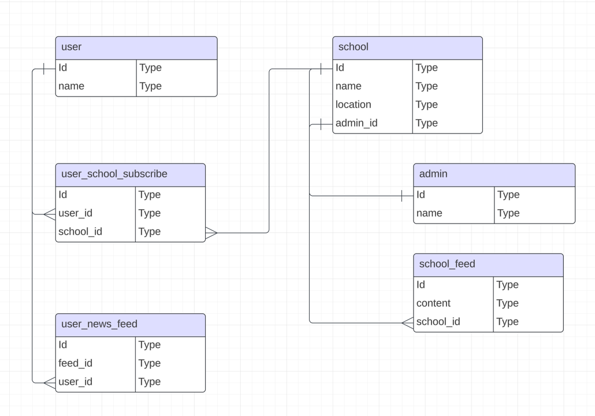

# 준비

1. node, docker 준비
2. npm install 실행
3. docker-compose up -d 실행으로 mysql 실행
4. mysql port 3399 root/root 로 접속 가능함.

# 서버 실행

1. npm run start 로 서버 실행 가능
2. http://localhost:3000/api 에서 API 문서 스웨거 확인

# unit 테스트
1. npm run test 로 실행

# e2e 테스트

1. npm run test:e2e 로 실행 

## 스키마

## 테스트 전략

1. service 레이어 테스트 는 mocking 을 통해 유닛 테스트로 진행
2. controller 레이어 테스트 는 통합 테스트로 진행한다.(디비레이어 입출력 까지 포함한다)
3. e2e 테스트 는 http 통신테스트 이미 다음을 목적으로 둔다.
   1. controller 레이어의 테스트
   2. 에러 시나리오 테스트
   2. 핵심적이며 복잡도가 높은 시나리오 중심으로 테스팅 한다.

## TODO

1. paging 처리
2. event emitter 를 추상화하여 메세지큐 로 다형성 처리.
3. 유닛 테스트 커버리지 상승.

회고: https://velog.io/@scarfunk/TIL-%ED%86%A0%EC%9D%B4%ED%94%84%EB%A1%9C%EC%A0%9D%ED%8A%B81-%ED%9A%8C%EA%B3%A0

코틀린버전: https://github.com/scarfunk/kt-school?tab=readme-ov-file
